# CS3217 - Storyteller

Final Project for [CS3217: Software Engineering for Modern Application Platforms](https://cs3217.github.io/cs3217-docs/)

By: Marcus, Pan Yongjing, and Tian Fang

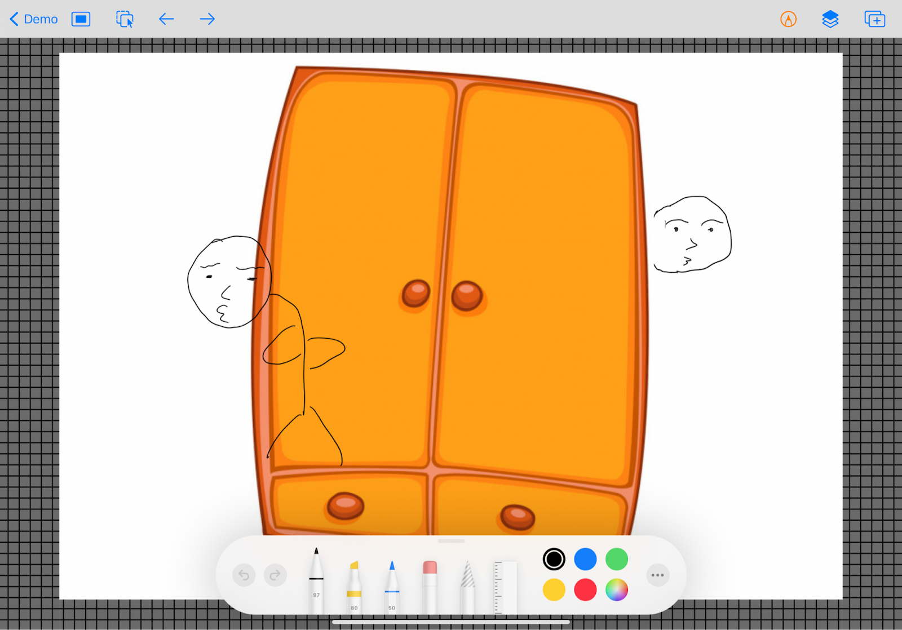

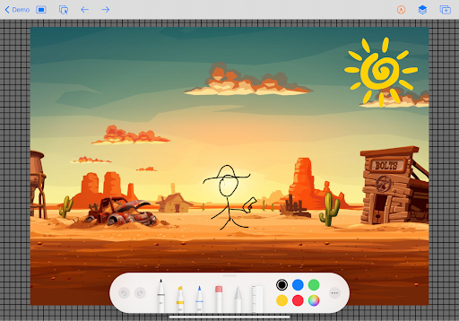

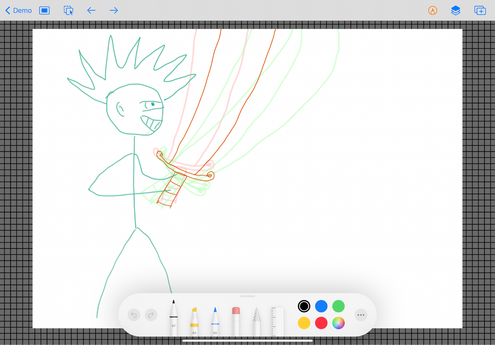

## Overview

Traditionally in the film industry, there is normally a drawer/designer who is in charge of storyboard design. However, hiring a dedicated person for storyboards is not always feasible for small-budget or personal projects. Additionally, more independent filmmakers are emerging nowadays as film equipment is getting more accessible. Therefore, we want to come up with an app to help filmmakers and videographers to design their storyboards with ease using their iPads. The users can effortlessly draw rough sketches to describe their shots and order different shots in various scenes using our app.

## Features and Specifications

#### Folders/Directories Navigation
* Create Folders
* Delete Folders
* Rearrange Folders
* Rename Folders

#### Project Navigation
* Add Project
* Delete Project
* Rename Project

#### Scene/Shot Navigation
* Add Scenes
* Delete Scenes
* Add Shots
* Rearrange shots
* Set Background Color

#### Canvas
* Draw on the canvas
* Use various tools on the canvas
  * Different colored pens
  * Lasso Tools
  * Ruler
* Work with layers on the canvas
  * Add layers
  * Edit layers
  * Remove layers
* Duplicate shot
* Onion Skin
* Directories system

## User Manual
Environmental Assumptions: 
* The app will be run on an iPad with iOS 14.4

#### 1. Start the app
#### 2. Select a folder or a project. A folder may contain subfolders and projects.
#### 3. Select an existing project or create a new project or folder by clicking the “+” button

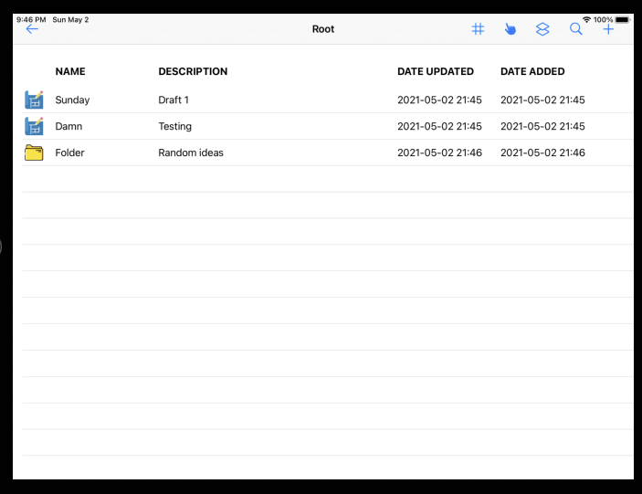

Click the top-right add button to add either a folder or a project. 

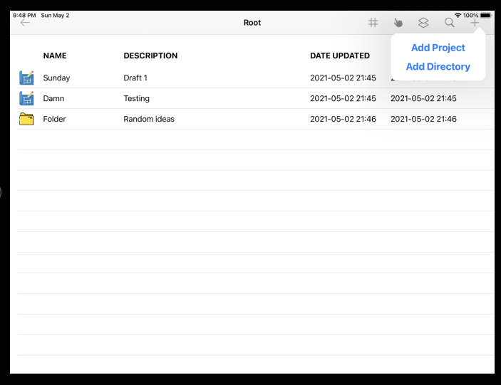

A folder can contain other folders or projects. There are options to select, delete and move an existing folder to different directories. 

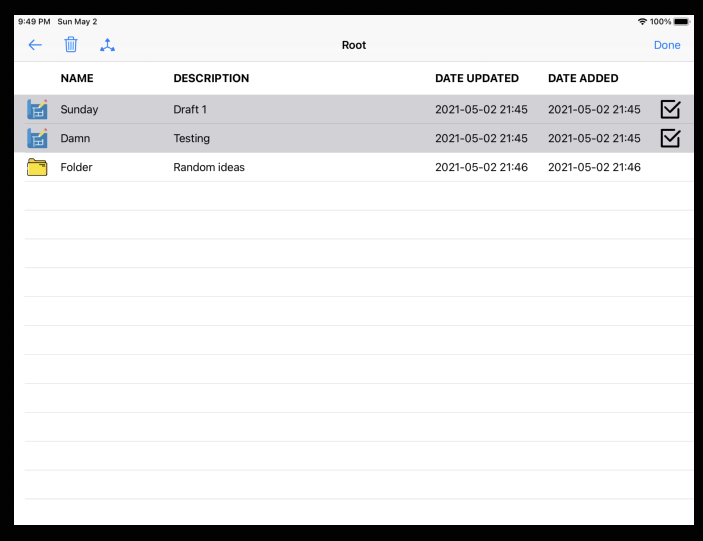

#### 4. Once the user enters a project, all the scenes and shots in the project will be shown, and the user can select a shot to edit

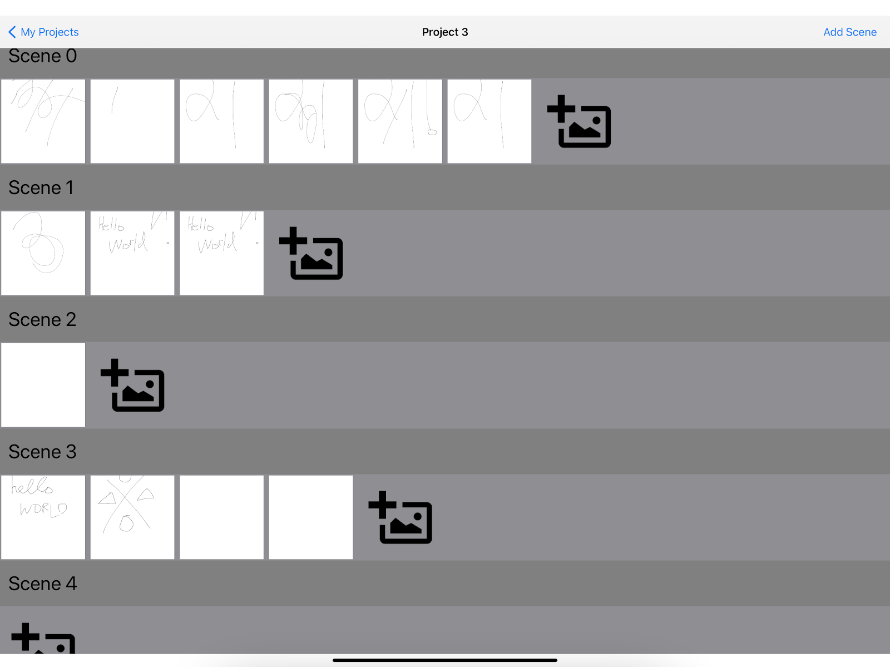

* Click the top right “+” button to add a new scene
* Click the “+” button behind the shots in a scene to add a new blank shot to the scene
* Click the back button to return to the projects screen
* Long press to reorder shots within a single scene
* Pressing on the DELETE button at the top right of each scene header deletes the scene. 

#### 5. Start drawing

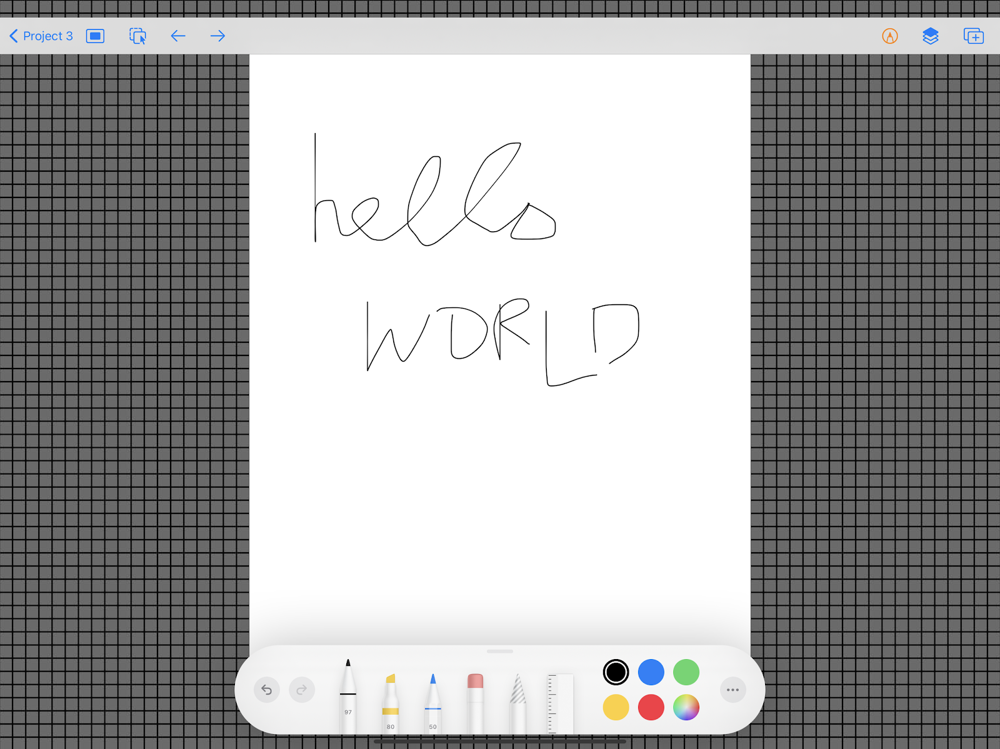

* Click the rightmost button to create and add a copy of the shot into the same scene
* Toggle the settings on the toolkit.
  * Drawing tools: Pen, Marker, Pencil
  * Ruler
  * Eraser
  * Colors
  * Lasso Tool
* Your work will be continuously saved as you draw or make other changes
* Swipe from the left of the screen to return to the shots screen

#### 6. Working with Layers

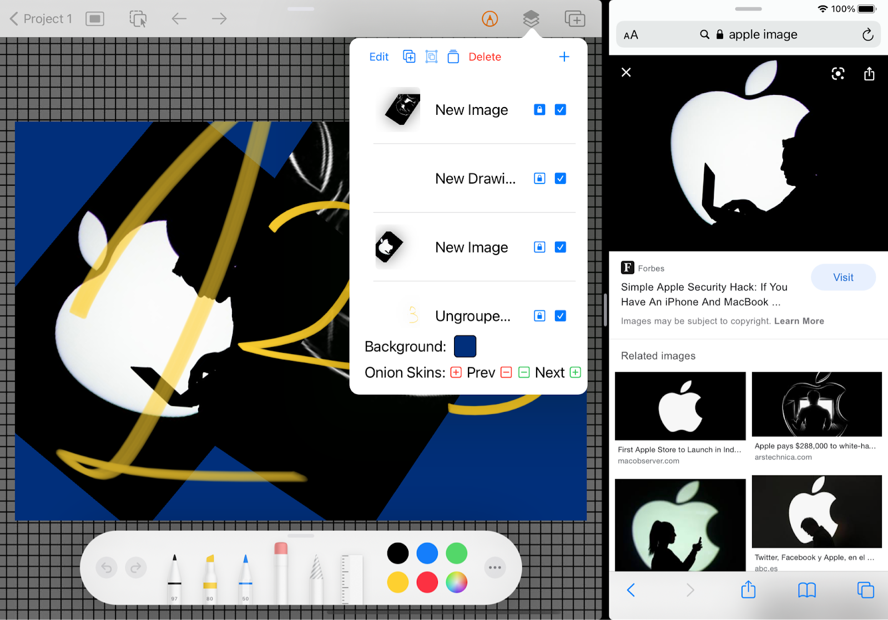

Each shot has several layers stacked on top of each other.
* The second button from the right in the navigation bar allows you to see your layers
* Select a layer if you wish for additional drawing on your current shot to be saved to the layer

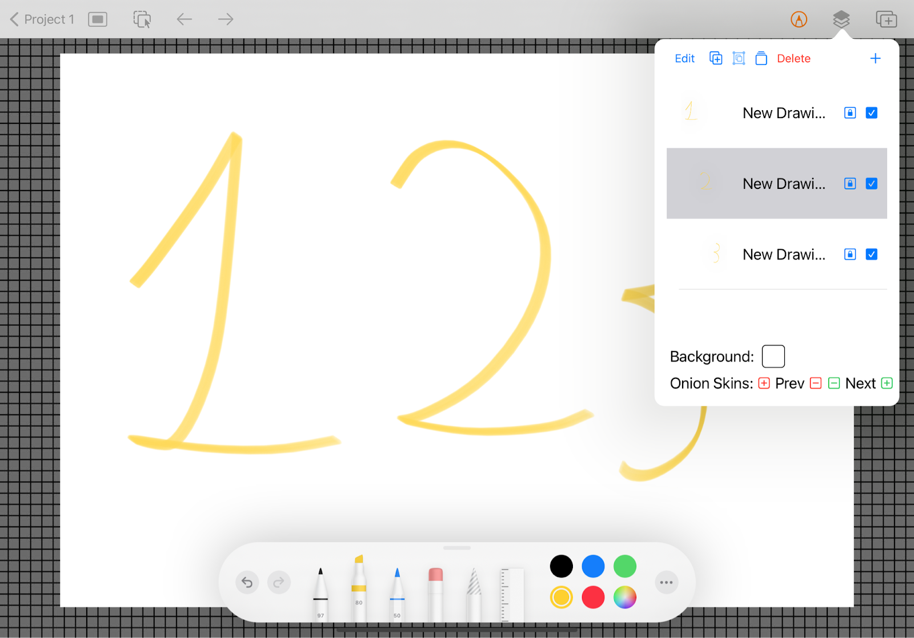

* You can untick the checkbox in each layer to hide it
* You can click Edit and drag layers to reorder them
* You can click Edit, select layers, and delete them

#### 7. Resizing, rotating, and translating canvas/layer

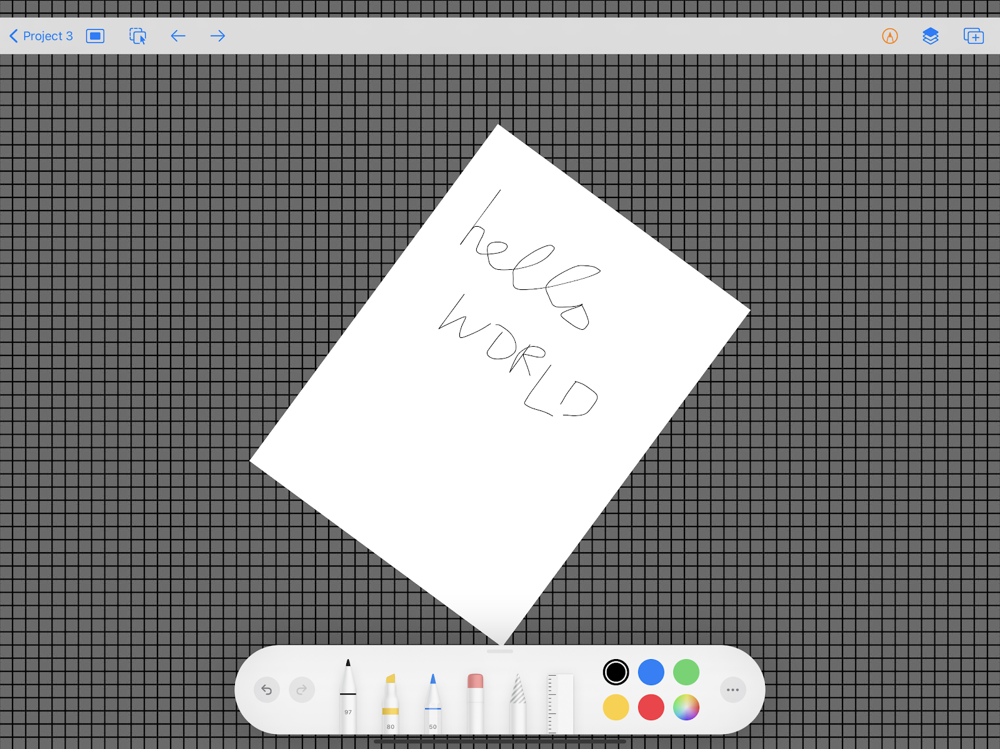

* To resize the canvas, simply pinch on your canvas.
* To rotate the canvas, you can use two fingers dragged in opposite directions
* Rotating and resizing be performed simultaneously
* Canvas can be translated using two fingers
* Click the second button from the left which allows you to rotate/resize/translate the current layer’s drawing instead of the canvas
* Click the leftmost button to reset any rotation made to canvas or layer drawing.

#### 8. Navigation
* You can navigate from the current shot to the next or previous shot within a scene using the left and right arrows on the navigation bar

#### 9. Changing background color

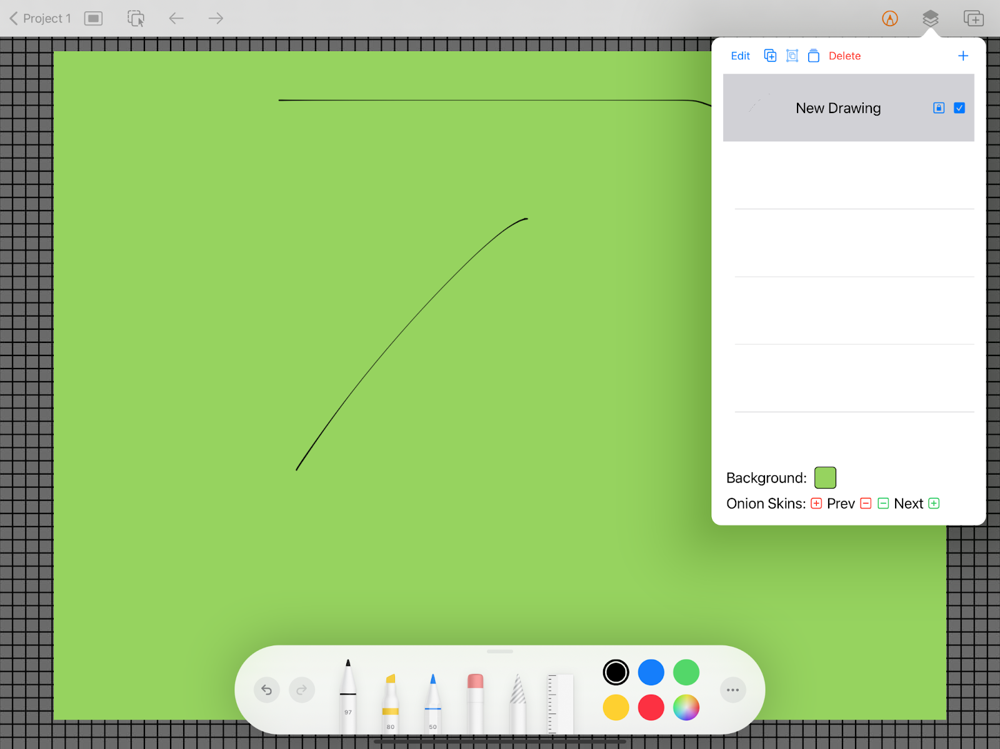

* Click the second button from the right at the top of the canvas
* Click the background color button to change the background color of the shot

#### 10. Onion Skin

 
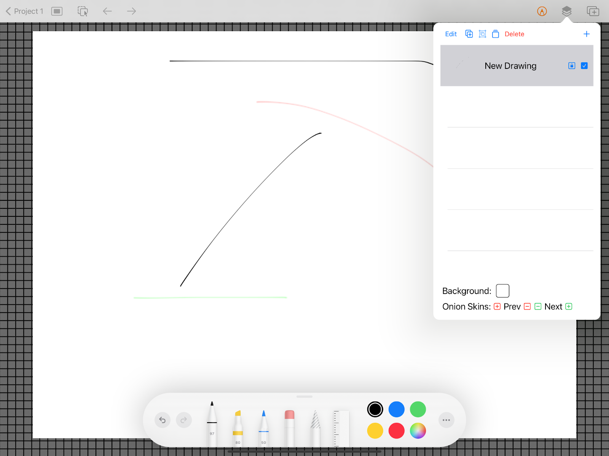

* Click the second button from the right at the navigation bar
* Click the previous (red) / next (green) PLUS onion skin button to display a semi-transparent outline of the previous / next shots (Number of click = one additional shot before/after if any)
* Similarly, MINUS button to hide one additional shot before/after if any is displayed.

#### 11. Grouping Layers
* Click Edit
* Select layers you wish to group
* Select the button to the right of Edit (“Group” button)

#### 12. Ungrouping Layers
* Select a layer
* Click the Button to the right of “Group” button (“Ungroup” button)

## Proposal and Sprint Reports

* [Project Proposal](https://drive.google.com/file/d/1wkOTV8oqU-ORV38TS4RJgCVhThqkV0Pu/view)
* [Sprint 1 Report](https://drive.google.com/file/d/1IIjOvi7c_584F3hA4Gl6qWrTW_CinZbH/view)
* [Sprint 2 Report](https://drive.google.com/file/d/1eF8QLjRr-KLeBiwF7R_JhLm7nMggWKG9/view)
* [Final Report](https://drive.google.com/file/d/1o2W_AzxKW8Fqr8yy4AAVU1SC2gU2HcEi/view)
* [Extension Report](https://drive.google.com/file/d/1FgwAAzJ8Ol7NmNz8psVnIHnR7qjGwZxx/view)
